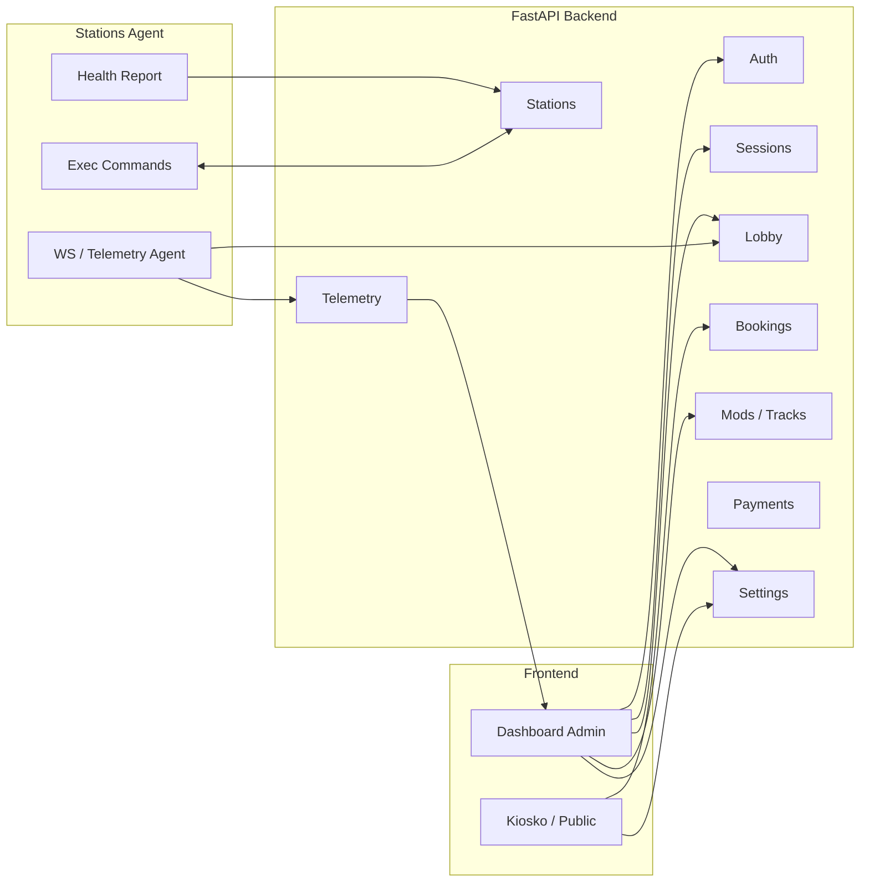

# Flujo Completo De La App (AC-MANAGER)

Este documento describe el flujo **end-to-end** del sistema según el código actual del proyecto. No asume comportamientos que no están implementados. Cuando hay ambigüedad, se indica explícitamente.

## 1. Qué Es El Sistema

Plataforma de gestión para un centro de simuladores (Assetto Corsa) con:

- Backend API (FastAPI) para operaciones de negocio, telemetría y control de estaciones.
- Agente en estaciones (PCs de simulador) que se conecta por WebSocket.
- Frontend (dashboard/admin + kiosko) para operar el negocio.
- Servicios auxiliares: contenido/mods, telemetría, perfiles, reservas, pagos, etc.

## 2. Actores Principales

- **Administrador**: opera el panel, crea sesiones, gestiona estaciones, contenidos y ajustes.
- **Cliente/Kiosko**: inicia reservas y sesiones desde interfaz pública.
- **Agente de estación**: programa en cada PC que reporta estado, telemetría y ejecuta comandos.
- **Sistema de pagos**: Stripe/Bizum (según configuración).

## 3. Flujo De Arranque (Sistema)

1. Backend se inicia (`start_server*.bat`, uvicorn).
2. Frontend se inicia (`start_system*.bat`, `start_system_prod.bat`).
3. El backend expone `/docs` y `/health` para verificación.
4. Variables de entorno definen:
   - Base de datos
   - Tokens (AGENT_TOKEN, PUBLIC_API_TOKEN)
   - Modo (ENVIRONMENT)

## 4. Flujo De Estaciones (Agente)

1. El **agente** se registra con `POST /stations/` (requiere `X-Agent-Token` si aplica).
2. El backend guarda estación y la marca como online.
3. El agente abre WebSocket en `/ws/telemetry/agent` y envía un mensaje `identify`.
4. El backend:
   - Marca estación online
   - Puede enviar comandos automáticos (`scan_content`, etc.)
5. El agente reporta salud con `POST /hardware/report`.

## 5. Flujo De Sesión De Juego (Single Player)

1. Admin usa el dashboard para iniciar sesión:
   - `POST /sessions/start`
2. Backend valida estación y crea sesión activa.
3. Puede enviar comandos al agente vía WebSocket (`launch_session`).
4. Al terminar, se llama `POST /sessions/{id}/stop`.

## 6. Flujo De Multijugador (Lobby)

1. Admin crea lobby:
   - `POST /lobby/create?host_station_id=...`
2. Backend valida estación host online y crea lobby.
3. Jugadores se unen:
   - `POST /lobby/{id}/join`
4. Ready:
   - `POST /lobby/{id}/ready`
5. Start:
   - `POST /lobby/{id}/start`
6. Backend envía comandos `create_lobby` y `join_lobby` a las estaciones via WebSocket.
7. Cancelación:
   - `DELETE /lobby/{id}`

## 7. Flujo De Telemetría

**WS (tiempo real)**

1. Agente envía datos al WS (`/ws/telemetry/agent`).
2. Backend reenvía a clientes WS (`/ws/telemetry/client`).
3. Si `event == LapCompleted`, guarda tiempos básicos.

**HTTP (sesiones completas)**

1. Agente envía sesión con `POST /telemetry/session`.
2. Backend guarda `SessionResult` y laps con telemetría.

## 8. Flujo De Reservas (Booking / Kiosko)

1. Kiosko o web pública crea reserva (`/bookings`).
2. Se validan fechas y slots disponibles.
3. Admin gestiona reservas desde dashboard.

> Nota: `reservations` legacy fue migrado a `bookings`.

## 9. Flujo De Configuración

1. Ajustes públicos via `GET /settings`.
2. Ajustes sensibles via `GET /settings/secure` (admin).
3. Logo se sube con `POST /settings/upload-logo`.

## 10. Flujo De Contenido (Mods/Tracks)

1. Admin sube zip con `POST /mods/upload`.
2. Backend extrae, analiza, y genera manifest.
3. Tags se auto-asignan.
4. Mods listados con `GET /mods`.
5. Tracks disponibles con `GET /tracks/list`.

## 11. Flujo De Pagos

1. Se crea pago con `POST /payments`.
2. Backend responde con checkout / instrucciones.
3. Se actualiza estado cuando el proveedor confirma.

> Nota: requiere configuración de Stripe/Bizum.

## 12. Flujo De Actualizaciones De Agente

1. Admin sube ZIP via `POST /system/update`.
2. Backend almacena y expone `/system/version`.
3. Agentes consultan versión y descargan actualizaciones.

## 13. Flujo De Observabilidad

1. `GET /system/metrics` expone snapshot básico.
2. Se registran eventos de acciones críticas.

## 14. Puntos Críticos / Dependencias

- **Tokens**: AGENT_TOKEN / PUBLIC_API_TOKEN deben estar configurados en producción.
- **DB**: migraciones consistentes con modelos.
- **Estaciones**: deben estar online para multijugador y sesiones reales.
- **Contenido**: mods/track dependen del filesystem del servidor.

## 15. Mapa Mental (Resumen)

- Backend (FastAPI)
  - Auth
  - Stations / Agents
  - Sessions
  - Lobby / Multiplayer
  - Telemetry (WS + HTTP)
  - Bookings
  - Mods / Tracks
  - Payments
  - Settings
- Frontend
  - Dashboard Admin
  - Kiosko / Public
- Agents
  - WS identify + telemetry
  - comandos remotos

## 16. Diagrama (Mermaid)

---

Documento generado automáticamente para ayudarte a entender el flujo global. Si necesitas más detalle por módulo, indícalo y lo desgloso.
