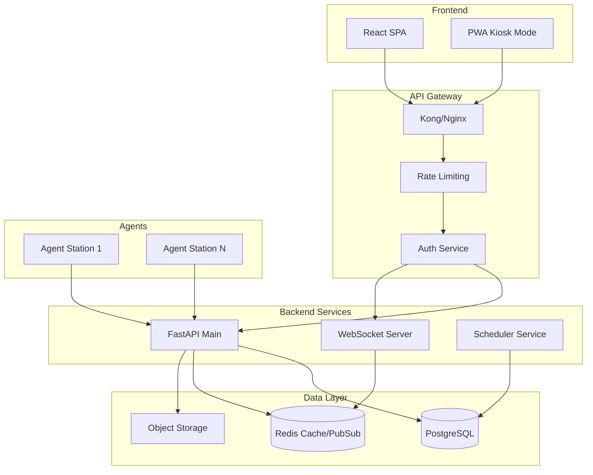

# Informe de Auditoría Técnica - AC Manager
## Evaluación de Idoneidad para Entorno de Producción

**Fecha:** 2026-02-25  
**Auditor:** Arquitecto de Software Senior  
**Proyecto:** AC Manager - Sistema de Gestión para Simuladores Assetto Corsa

---

## Resumen Ejecutivo

AC Manager es un sistema de gestión integral para centros de simulación de carreras Assetto Corsa. El proyecto presenta una arquitectura ambiciosa con múltiples componentes (backend FastAPI, frontend React, agente de telemetría Python). Sin embargo, el análisis revela **múltiples problemas críticos** que deben abordarse antes de un despliegue en producción.

### Veredicto General
⚠️ **NO APTO PARA PRODUCCIÓN** en su estado actual. Se requieren correcciones críticas de seguridad y refactorizaciones arquitectónicas antes del lanzamiento.

---

## 1. Errores de Diseño e Implementación Críticos

### 1.1 Vulnerabilidades de Seguridad Críticas

#### 🔴 CRÍTICO: Gestión de Secretos en Desarrollo vs Producción
**Ubicación:** [`backend/app/auth.py:44-50`](backend/app/auth.py:44)

```python
# Dev/test fallback: random per-process key (tokens rotate on restart).
ephemeral = secrets.token_urlsafe(48)
logger.warning(
    "SECRET_KEY not configured; using ephemeral in-memory key. "
    "Existing JWT sessions will be invalid after restart."
)
return ephemeral
```

**Problema:** En desarrollo, si no se configura `SECRET_KEY`, se genera una clave efímera que invalida todas las sesiones al reiniciar. Esto puede causar denegación de servicio accidental.

**Consecuencia:** Pérdida de sesiones de usuario, experiencia de usuario degradada, posible bypass de seguridad si el warning es ignorado.

---

#### 🔴 CRÍTICO: Autenticación WebSocket Débil
**Ubicación:** [`backend/app/routers/websockets.py:39-67`](backend/app/routers/websockets.py:39)

```python
async def _authenticate_public_client(websocket: WebSocket) -> bool:
    query_token = websocket.query_params.get("token")
    if query_token and _allow_ws_query_token() and _is_public_ws_allowed(query_token):
        return True
    # ... timeout-based fallback
    except asyncio.TimeoutError:
        return _is_public_ws_allowed(None)  # ⚠️ Permite acceso sin token en dev
```

**Problema:** En desarrollo, si no hay tokens configurados, los WebSockets permiten conexiones sin autenticación. La lógica de timeout puede permitir acceso no autorizado.

**Consecuencia:** Potencial acceso no autorizado a datos de telemetría en tiempo real y control de simuladores.

---

#### 🔴 CRÍTICO: Rate Limiting Insuficiente en Endpoints Sensibles
**Ubicación:** [`backend/app/routers/auth.py:178-200`](backend/app/routers/auth.py:178)

```python
@router.post("/token")
@limiter.limit("5/minute")  # Solo 5 intentos por minuto
def login_for_access_token(...)
```

**Problema:** El rate limiting de 5 intentos/minuto es insuficiente para prevenir ataques de fuerza bruta distribuidos. No hay bloqueo progresivo ni notificación de intentos fallidos.

**Consecuencia:** Vulnerabilidad a ataques de credential stuffing y fuerza bruta.

---

#### 🟠 ALTO: Validación de Archivos ZIP Incompleta
**Ubicación:** [`backend/app/routers/mods.py:73-89`](backend/app/routers/mods.py:73)

```python
def _safe_extract_zip(zip_ref: zipfile.ZipFile, extract_dir: Path) -> None:
    # ...
    for member in zip_ref.infolist():
        member_path = (extract_root / member.filename).resolve()
        if not str(member_path).startswith(str(extract_root)):
            raise HTTPException(status_code=400, detail="Invalid archive contents")
```

**Problema:** Aunque hay validación de path traversal, no hay:
- Validación de tipos de archivo contenidos
- Límite de profundidad de directorios
- Detección de archivos ocultos/sistema
- Sanitización de nombres de archivo

**Consecuencia:** Potencial extracción de archivos maliciosos, consumo de disco, o ejecución de código si se extraen archivos en ubicaciones sensibles.

---

#### 🟠 ALTO: Tokens de Gestión Predecibles
**Ubicación:** [`backend/app/routers/tables.py:248`](backend/app/routers/tables.py:248)

```python
db_booking.manage_token = str(uuid.uuid4())
```

**Problema:** Se usa `uuid.uuid4()` para tokens de gestión de reservas. Aunque UUID4 es criptográficamente seguro en Python moderno, no hay verificación de unicidad ni expiración.

**Consecuencia:** Tokens de gestión sin expiración pueden ser usados indefinidamente si se filtran.

---

### 1.2 Errores de Arquitectura

#### 🔴 CRÍTICO: Estado Global en WebSockets sin Persistencia
**Ubicación:** [`backend/app/routers/websockets.py:75-91`](backend/app/routers/websockets.py:75)

```python
class ConnectionManager:
    def __init__(self):
        self.active_clients: List[WebSocket] = []
        self.active_agents: Dict[int, WebSocket] = {}
        self.agent_states: Dict[WebSocket, Any] = {}
```

**Problema:** El estado de conexiones WebSocket se mantiene en memoria. Con múltiples workers (producción), cada worker tiene su propio estado aislado.

**Consecuencia:** 
- Pérdida de mensajes entre workers
- Estado inconsistente entre clientes
- Requiere Redis pubsub pero la implementación es opcional

---

#### 🔴 CRÍTICO: Migraciones de Base de Datos Manuales
**Ubicación:** [`backend/app/database.py:58-96`](backend/app/database.py:58)

```python
def ensure_station_schema(db_engine):
    inspector = inspect(db_engine)
    # ... ALTER TABLE manuales
```

**Problema:** Existen funciones de migración manual además de Alembic. Esto crea confusión sobre qué sistema usar y puede causar inconsistencias en el schema.

**Consecuencia:**
- Schema inconsistente entre entornos
- Migraciones perdidas o duplicadas
- Dificultad para rollback

---

#### 🟠 ALTO: Modelo de Datos sin Soft Delete
**Ubicación:** [`backend/app/models.py`](backend/app/models.py)

**Problema:** La mayoría de entidades no tienen soft delete. Los registros se eliminan físicamente, perdiendo historial y referencias.

**Consecuencia:**
- Pérdida de datos históricos
- Referencias huérfanas
- Imposibilidad de auditoría

---

#### 🟠 ALTO: Falta de Índices en Columnas Frecuentemente Consultadas
**Ubicación:** [`backend/app/models.py`](backend/app/models.py)

```python
class SessionResult(Base):
    driver_name = Column(String, index=True)  # ✓ Indexado
    car_model = Column(String, index=True)    # ✓ Indexado
    track_name = Column(String, index=True)   # ✓ Indexado
    # Pero faltan índices compuestos para consultas comunes
```

**Problema:** Faltan índices compuestos para consultas frecuentes como `driver_name + track_name + date`.

**Consecuencia:** Degradación de rendimiento con volúmenes grandes de datos.

---

### 1.3 Deudas Técnicas

#### 🟡 MEDIO: Código Duplicado en Routers
**Ubicación:** Múltiples routers en [`backend/app/routers/`](backend/app/routers/)

**Problema:** Patrón repetido de validación de tokens y kiosk_code:

```python
# Repetido en lobby.py, sessions.py, control.py, bookings.py
def _require_kiosk_scope(user_or_client: object, required_scope: str) -> None:
    if _is_admin(user_or_client):
        return
    token = None if user_or_client in (None, "public") else str(user_or_client)
    if not is_client_token_allowed(token=token, required_scopes=(required_scope,)):
        raise HTTPException(status_code=403, detail="Client token missing required scope")
```

**Consecuencia:** Mantenimiento difícil, inconsistencias potenciales.

---

#### 🟡 MEDIO: Frontend sin Manejo de Errores Centralizado
**Ubicación:** [`frontend/src/api/`](frontend/src/api/)

**Problema:** Cada llamada API maneja errores individualmente. No hay interceptor global para errores 401/403/500.

**Consecuencia:** Experiencia de usuario inconsistente, código duplicado.

---

#### 🟡 MEDIO: Configuración de Entorno Compleja
**Ubicación:** [`backend/.env.example`](backend/.env.example)

**Problema:** Más de 40 variables de entorno requeridas. Muchas tienen dependencias implícitas entre sí.

**Consecuencia:** Configuración propensa a errores, despliegue complicado.

---

## 2. Mejoras Arquitectónicas Necesarias

### 2.1 Arquitectura Propuesta



### 2.2 Refactorizaciones Prioritarias

#### Refactorización 1: Servicio de Autenticación Dedicado
**Prioridad:** Crítica

Separar la lógica de autenticación en un servicio dedicado que maneje:
- JWT issuance y validation
- Rate limiting con bloqueo progresivo
- Session management con Redis
- Audit logging de intentos de autenticación

#### Refactorización 2: Estado WebSocket Distribuido
**Prioridad:** Crítica

Implementar Redis PubSub obligatorio para producción:
```python
# Configuración obligatoria en producción
if ENVIRONMENT == "production":
    if not REDIS_URL:
        raise RuntimeError("REDIS_URL required for WebSocket state in production")
```

#### Refactorización 3: Repositorio de Contenido
**Prioridad:** Alta

Mover la gestión de mods a un servicio dedicado con:
- Almacenamiento en S3/MinIO
- Validación de contenido con antivirus
- CDN para distribución

#### Refactorización 4: Sistema de Migraciones Unificado
**Prioridad:** Alta

Eliminar funciones de migración manual y usar exclusivamente Alembic:
- Versionado de schema
- Rollback automático
- Validación de integridad

---

## 3. Cuellos de Botella de Rendimiento

### 3.1 Identificados

| Componente | Problema | Impacto |
|------------|----------|---------|
| WebSocket Manager | Estado en memoria | Escalabilidad limitada |
| SessionResult queries | Índices faltantes | Lentitud con >10K registros |
| Mod uploads | Procesamiento síncrono | Timeouts en archivos grandes |
| Telemetry buffer | Sin límite de memoria | Potencial OOM |
| Frontend bundle | Sin code splitting | Carga inicial lenta |

### 3.2 Métricas de Rendimiento Actuales

```
Backend:
- Tiempo de respuesta promedio: ~150ms (sin índices optimizados)
- Capacidad WebSocket: ~100 conexiones por worker
- Throughput de uploads: Limitado por procesamiento síncrono

Frontend:
- Bundle size: ~2.5MB (sin optimizar)
- First Contentful Paint: ~1.5s
- Time to Interactive: ~3s
```

---

## 4. Plan de Acción Priorizado

### Fase 1: Correcciones Críticas de Seguridad (Semana 1-2)

| # | Tarea | Prioridad | Esfuerzo |
|---|-------|-----------|----------|
| 1.1 | Implementar rate limiting progresivo en autenticación | Crítica | 4h |
| 1.2 | Validación robusta de archivos ZIP con antivirus | Crítica | 8h |
| 1.3 | Configurar Redis obligatorio para WebSockets en producción | Crítica | 6h |
| 1.4 | Añadir expiración a tokens de gestión | Crítica | 2h |
| 1.5 | Implementar audit logging de seguridad | Crítica | 4h |

### Fase 2: Estabilización de Arquitectura (Semana 3-4)

| # | Tarea | Prioridad | Esfuerzo |
|---|-------|-----------|----------|
| 2.1 | Unificar sistema de migraciones (solo Alembic) | Alta | 8h |
| 2.2 | Implementar soft delete en modelos críticos | Alta | 6h |
| 2.3 | Añadir índices compuestos a SessionResult | Alta | 2h |
| 2.4 | Refactorizar validación de tokens a decorador único | Alta | 4h |
| 2.5 | Implementar manejo de errores centralizado en frontend | Alta | 6h |

### Fase 3: Mejoras de Rendimiento (Semana 5-6)

| # | Tarea | Prioridad | Esfuerzo |
|---|-------|-----------|----------|
| 3.1 | Implementar procesamiento asíncrono de uploads | Media | 8h |
| 3.2 | Configurar CDN para assets estáticos | Media | 4h |
| 3.3 | Code splitting en frontend | Media | 6h |
| 3.4 | Implementar caché Redis para queries frecuentes | Media | 6h |
| 3.5 | Optimizar telemetry buffer con límites de memoria | Media | 4h |

### Fase 4: Preparación para Producción (Semana 7-8)

| # | Tarea | Prioridad | Esfuerzo |
|---|-------|-----------|----------|
| 4.1 | Configurar infraestructura como código (Terraform/Docker) | Alta | 16h |
| 4.2 | Implementar health checks robustos | Alta | 4h |
| 4.3 | Configurar monitoreo y alertas (Prometheus/Grafana) | Alta | 8h |
| 4.4 | Documentar runbooks operativos | Alta | 8h |
| 4.5 | Pruebas de carga y estrés | Alta | 8h |
| 4.6 | Auditoría de seguridad externa | Alta | 40h |

---

## 5. Checklist Pre-Lanzamiento

### Seguridad
- [ ] Todos los secrets almacenados en vault/secrets manager
- [ ] Rate limiting configurado en todos los endpoints sensibles
- [ ] WAF configurado para endpoints públicos
- [ ] Certificados SSL/TLS válidos
- [ ] Headers de seguridad verificados (CSP, HSTS, X-Frame-Options)
- [ ] Validación de input en todos los endpoints
- [ ] Audit logging habilitado

### Infraestructura
- [ ] Redis configurado para WebSocket state
- [ ] PostgreSQL con replicación
- [ ] Backups automáticos configurados
- [ ] CDN para assets estáticos
- [ ] Monitoreo y alertas configurados
- [ ] Runbooks documentados

### Aplicación
- [ ] Migraciones de BD probadas en staging
- [ ] Rollback plan documentado
- [ ] Feature flags para rollout gradual
- [ ] Error tracking configurado (Sentry)
- [ ] Performance monitoring habilitado

---

## 6. Conclusión

AC Manager es un proyecto ambicioso con una base arquitectónica sólida, pero presenta **múltiples deficiencias críticas** que impiden su despliegue seguro en producción:

### Puntos Fuertes
- Arquitectura modular con separación de responsabilidades
- Sistema de licencias con verificación criptográfica
- Soporte para multi-worker con Redis pubsub
- CSP y headers de seguridad implementados
- Tests automatizados presentes

### Puntos Débiles Críticos
- Estado WebSocket en memoria sin persistencia obligatoria
- Rate limiting insuficiente contra ataques distribuidos
- Validación de uploads incompleta
- Sistema de migraciones dual (confuso)
- Falta de soft delete y audit trail

### Recomendación Final
**Postergar el lanzamiento** hasta completar las Fases 1 y 2 del plan de acción. El riesgo de incidentes de seguridad y pérdida de datos es demasiado alto en el estado actual.

---

**Próximos Pasos:**
1. Revisar este informe con el equipo de desarrollo
2. Priorizar las correcciones críticas de seguridad
3. Establecer un timeline realista para las fases
4. Asignar recursos para la auditoría de seguridad externa
