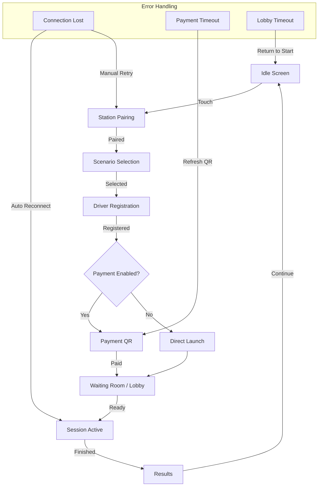
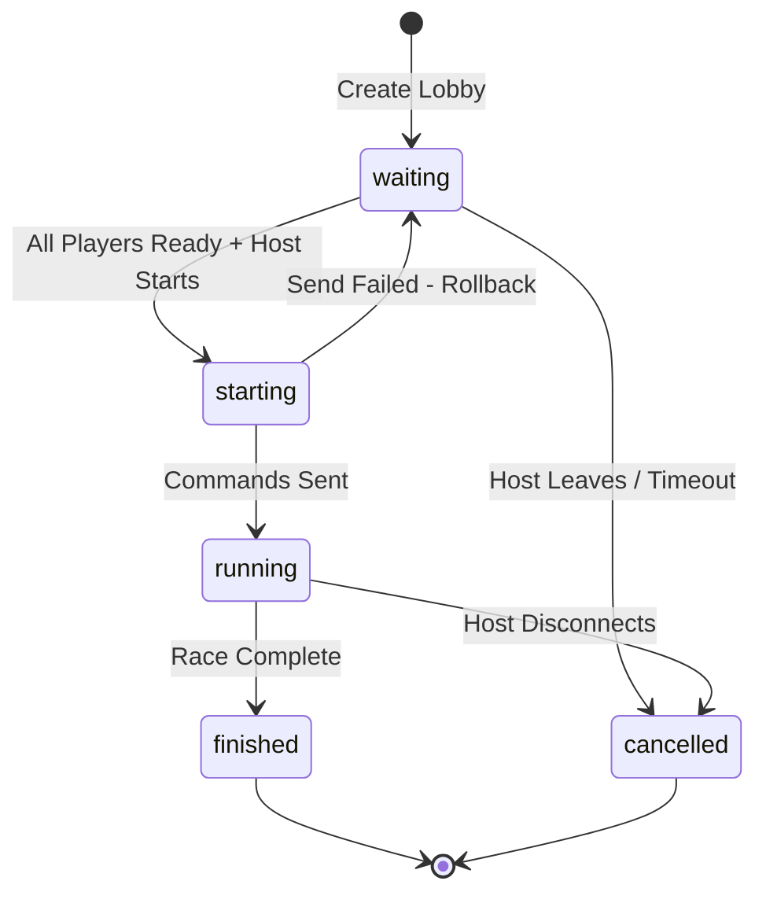

# Plan de Mejoras para Producción - Kiosko y Multijugador

## Resumen Ejecutivo

Este documento detalla las mejoras necesarias para llevar el sistema de Kiosko y Multijugador a un estado listo para producción. Se han identificado **15 issues críticos** y **23 mejoras recomendadas** distribuidas entre frontend y backend.

---

## 1. Issues Críticos - Kiosko

### 1.1 Manejo de Errores y Resiliencia

| ID | Severidad | Archivo | Descripción |
|----|-----------|---------|-------------|
| K-001 | CRÍTICO | `KioskMode.tsx`, `KioskModern.tsx`, `KioskRacing.tsx` | **Sin manejo de reconexión**: Si se pierde la conexión al backend durante una sesión, el kiosko no tiene lógica de reconexión automática. El usuario queda en estado limbo. |
| K-002 | CRÍTICO | `KioskSteps.tsx:873-1062` | **WaitingRoom sin timeout**: La sala de espera no tiene un timeout máximo. Si el host nunca inicia, los jugadores esperan indefinidamente. |
| K-003 | ALTO | `KioskMode.tsx:164-175` | **Timeout de inactividad muy corto**: 90 segundos puede ser insuficiente para completar el flujo de pago. Los usuarios pierden su progreso. |
| K-004 | ALTO | `KioskSteps.tsx:668-744` | **Mutaciones sin retry**: `createLobbyMutation` y `joinLobbyMutation` no tienen reintentos automáticos. Un fallo de red temporal arruina la experiencia. |

### 1.2 Accesibilidad y UX

| ID | Severidad | Archivo | Descripción |
|----|-----------|---------|-------------|
| K-005 | ALTO | `KioskSteps.tsx`, `KioskContentStep.tsx` | **Sin feedback de carga**: Los botones de selección no muestran estado de carga mientras se obtienen datos. |
| K-006 | MEDIO | `KioskMode.tsx`, `KioskModern.tsx` | **Múltiples variantes de Kiosko**: Existen 3 versiones (Mode, Modern, Racing) con código duplicado y sin clara diferenciación de uso. |
| K-007 | MEDIO | `KioskSteps.tsx:1104-1141` | **DriverStep sin validación**: El campo de nombre de piloto no tiene validación de longitud mínima/máxima ni sanitización. |

### 1.3 Pagos

| ID | Severidad | Archivo | Descripción |
|----|-----------|---------|-------------|
| K-008 | CRÍTICO | `KioskSteps.tsx:763-836` | **PaymentStep sin manejo de expiración**: El QR de pago no tiene tiempo de expiración visible. Si el usuario tarda demasiado, el pago puede fallar sin feedback claro. |
| K-009 | ALTO | `KioskSteps.tsx:748-810` | **Polling de pago ineficiente**: El polling cada 2 segundos puede sobrecargar el servidor. No hay backoff exponencial. |

---

## 2. Issues Críticos - Multijugador/Lobby

### 2.1 Backend - Lobby

| ID | Severidad | Archivo | Descripción |
|----|-----------|---------|-------------|
| L-001 | CRÍTICO | `lobby.py:107-110` | **Puerto fijo con colisión potencial**: El cálculo de puerto `9600 + (next_id % 100)` puede causar colisiones si hay más de 100 lobbies activos. |
| L-002 | CRÍTICO | `lobby.py:373-374` | **Mínimo 2 jugadores hardcodeado**: El requisito de 2 jugadores mínimo no es configurable. Torneos de 1 jugador (time attack) no son posibles. |
| L-003 | ALTO | `lobby.py:46-75` | **Cleanup de lobbies huérfanos ineficiente**: Se ejecuta en cada request a `/list` sin caché ni rate limiting. |
| L-004 | ALTO | `lobby.py:407-424` | **Sin rollback de estado**: Si `send_command` falla después de cambiar estado a "starting", el lobby queda en estado inconsistente. |
| L-005 | MEDIO | `lobby.py:426-444` | **Sin confirmación de join**: No se verifica que los jugadores realmente se unieron al servidor de Assetto Corsa. |

### 2.2 Frontend - Lobby

| ID | Severidad | Archivo | Descripción |
|----|-----------|---------|-------------|
| L-006 | CRÍTICO | `KioskSteps.tsx:937-963` | **Timer de sala desincronizado**: El timer de 180 segundos se calcula localmente. Si el cliente tiene hora incorrecta, el timer está mal. |
| L-007 | ALTO | `KioskSteps.tsx:898-920` | **ReadyMutation sin debounce**: Múltiples clicks rápidos pueden enviar múltiples requests. |
| L-008 | ALTO | `KioskStepsModern.tsx:367-565` | **Código duplicado**: La lógica de WaitingRoom está duplicada en 3 archivos diferentes. |

---

## 3. Plan de Mejoras - Kiosko

### Fase 1: Estabilidad y Resiliencia

```
[ ] K-001: Implementar reconexión automática
    - Añadir WebSocket con reconnection logic
    - Mostrar indicador de conexión perdida
    - Reintentar requests fallidos con backoff exponencial
    - Archivos: KioskMode.tsx, KioskModern.tsx, KioskRacing.tsx

[ ] K-002: Añadir timeout a WaitingRoom
    - Timeout máximo de 5 minutos
    - Mostrar countdown al usuario
    - Opción de "abandonar sala" visible
    - Archivos: KioskSteps.tsx, KioskStepsModern.tsx, KioskStepsRacing.tsx

[ ] K-003: Aumentar timeout de inactividad
    - Cambiar de 90s a 180s durante flujo de pago
    - Resetear timer en cada interacción
    - Mostrar advertencia a los 120s
    - Archivos: KioskMode.tsx

[ ] K-004: Añadir retry a mutaciones críticas
    - Implementar retry con backoff exponencial
    - Máximo 3 reintentos
    - Mostrar estado de reintento al usuario
    - Archivos: KioskSteps.tsx
```

### Fase 2: UX y Accesibilidad

```
[ ] K-005: Estados de carga en botones
    - Añadir spinner durante carga
    - Deshabilitar botón durante operación
    - Feedback visual de progreso
    - Archivos: KioskSteps.tsx, KioskContentStep.tsx

[ ] K-006: Consolidar variantes de Kiosko
    - Crear componente KioskShell unificado
    - Usar props para variar tema (arcade/modern/racing)
    - Eliminar código duplicado
    - Archivos: Nuevo KioskShell.tsx

[ ] K-007: Validación de DriverStep
    - Longitud mínima: 2 caracteres
    - Longitud máxima: 30 caracteres
    - Sanitización de caracteres especiales
    - Archivos: KioskSteps.tsx
```

### Fase 3: Pagos

```
[ ] K-008: Expiración de QR de pago
    - Mostrar countdown de expiración (15 min)
    - Auto-refresh de QR antes de expirar
    - Mensaje claro si expira
    - Archivos: KioskSteps.tsx

[ ] K-009: Optimizar polling de pago
    - Implementar backoff exponencial: 2s → 4s → 8s
    - Usar WebSocket para actualizaciones en tiempo real
    - Timeout máximo de 15 minutos
    - Archivos: KioskSteps.tsx
```

---

## 4. Plan de Mejoras - Multijugador/Lobby

### Fase 1: Backend - Estabilidad

```
[ ] L-001: Sistema de puertos dinámico
    - Crear tabla port_allocations
    - Reservar puerto al crear lobby
    - Liberar al finalizar
    - Rango configurable: 9600-9999
    - Archivos: lobby.py, models.py

[ ] L-002: Configuración de jugadores mínimos
    - Añadir campo min_players a Lobby model
    - Permitir lobbies de 1 jugador (time attack)
    - Validar en create y start
    - Archivos: lobby.py, models.py, schemas.py

[ ] L-003: Optimizar cleanup de lobbies
    - Mover a job programado (APScheduler)
    - Ejecutar cada 30 segundos
    - Añadir índice a status y host_station_id
    - Archivos: lobby.py, main.py

[ ] L-004: Transacciones atómicas
    - Usar db.begin_nested() para operaciones críticas
    - Rollback automático si send_command falla
    - Log de errores para debugging
    - Archivos: lobby.py

[ ] L-005: Confirmación de join
    - Añadir estado "joining" a jugadores
    - Agent confirma cuando se une al servidor AC
    - Timeout de 30s para confirmación
    - Archivos: lobby.py, websockets.py, agent
```

### Fase 2: Frontend - Sincronización

```
[ ] L-006: Timer sincronizado con servidor
    - Obtener tiempo restante del servidor
    - Calcular offset de reloj local
    - Mostrar tiempo sincronizado
    - Archivos: KioskSteps.tsx, lobby.py

[ ] L-007: Debounce en botones de ready
    - Añadir debounce de 500ms
    - Deshabilitar durante mutación
    - Mostrar estado de carga
    - Archivos: KioskSteps.tsx

[ ] L-008: Extraer WaitingRoom unificado
    - Crear WaitingRoomUniversal.tsx
    - Props para tema y variante
    - Eliminar duplicación
    - Archivos: Nuevo WaitingRoomUniversal.tsx
```

---

## 5. Mejoras Adicionales Recomendadas

### Seguridad

```
[ ] Rate limiting en endpoints de kiosko
    - 10 requests/minuto por station_id
    - Implementar con slowapi
    - Archivos: main.py, limiters.py

[ ] Validación de kiosk_code
    - Añadir expiración (24h)
    - Regenerar automáticamente
    - Log de uso sospechoso
    - Archivos: lobby.py, auth.py

[ ] Sanitización de inputs
    - Validar todos los campos de texto
    - Prevenir XSS en nombres
    - Archivos: schemas.py
```

### Monitoreo

```
[ ] Métricas de kiosko
    - Tiempo promedio por paso
    - Tasa de abandono
    - Errores de pago
    - Archivos: Nuevo kiosk_metrics.py

[ ] Alertas de lobby
    - Lobby stuck en "starting" > 1 min
    - Puerto no disponible
    - Host desconectado
    - Archivos: main.py
```

### Testing

```
[ ] Tests E2E de flujos de kiosko
    - Flujo completo de sesión individual
    - Flujo de lobby multijugador
    - Casos de error y recuperación
    - Archivos: tests/e2e/

[ ] Tests de carga de lobby
    - Simular 50 lobbies simultáneos
    - Verificar asignación de puertos
    - Verificar cleanup
    - Archivos: tests/load/
```

---

## 6. Arquitectura Propuesta

### Diagrama de Flujo de Kiosko Mejorado



### Diagrama de Estados de Lobby



---

## 7. Priorización

### Prioridad 1 - Bloqueantes para Producción
- K-001: Reconexión automática
- K-002: Timeout en WaitingRoom
- L-001: Sistema de puertos dinámico
- L-004: Transacciones atómicas

### Prioridad 2 - Importantes
- K-008: Expiración de QR
- L-003: Optimizar cleanup
- L-005: Confirmación de join
- Rate limiting

### Prioridad 3 - Mejoras de UX
- K-005: Estados de carga
- K-006: Consolidar variantes
- L-008: WaitingRoom unificado

### Prioridad 4 - Nice to Have
- Métricas y monitoreo
- Tests E2E
- Tests de carga

---

## 8. Estimación de Esfuerzo

| Categoría | Issues | Complejidad |
|-----------|--------|-------------|
| Kiosko - Estabilidad | 4 | Media-Alta |
| Kiosko - UX | 3 | Media |
| Kiosko - Pagos | 2 | Media |
| Lobby - Backend | 5 | Alta |
| Lobby - Frontend | 3 | Media |
| Seguridad | 3 | Media |
| Monitoreo | 2 | Baja |
| Testing | 2 | Media |

---

## 9. Próximos Pasos

1. **Revisar y aprobar este plan** con el equipo
2. **Crear branches** para cada fase
3. **Implementar Prioridad 1** primero
4. **Testing exhaustivo** antes de cada merge
5. **Deploy a staging** para validación
6. **Deploy a producción** con feature flags

---

*Documento creado: 2026-02-25*
*Autor: Kilo Code Architect*
