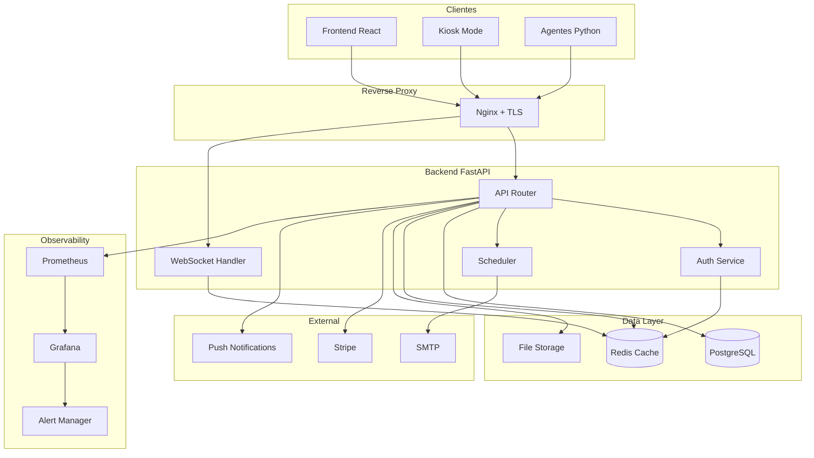

# Auditoría Técnica AC-MANAGER — Preparación para Producción

> **Fecha:** 2026-03-31  
> **Versión del proyecto:** Desarrollo avanzado  
> **Alcance:** Evaluación completa pre-despliegue para entorno de alta disponibilidad  
> **Autor:** Kilo Code (Architect Mode)

---

## Resumen Ejecutivo

AC-MANAGER es un sistema de gestión de simuladores Assetto Corsa para entornos arcade/bar. La arquitectura comprende un backend FastAPI + SQLAlchemy + PostgreSQL, un frontend React 19 + TypeScript + Vite, y agentes Python para comunicación con simuladores. La aplicación muestra un nivel de desarrollo avanzado con buena estructura modular, pero presenta **hallazgos críticos y altos** que deben resolverse antes del despliegue en producción.

### Clasificación de Hallazgos

| Criticidad | Cantidad | Descripción |
|---|---|---|
| 🔴 Crítico | 8 | Vulnerabilidades de seguridad o fallos que impiden operación segura |
| 🟠 Alto | 12 | Problemas que afectan rendimiento, resiliencia o cumplimiento |
| 🟡 Medio | 10 | Mejoras recomendadas para mantenibilidad y robustez |
| 🟢 Bajo | 6 | Optimizaciones y buenas prácticas |

---

## 1. Seguridad y Gestión de Accesos

### 1.1 🔴 CRÍTICO — Secretos en archivos de ejemplo y configuración

**Ubicación:** [`backend/.env.production.example`](backend/.env.production.example:6), [`backend/app/auth.py`](backend/app/auth.py:31)

**Hallazgo:** Los archivos de ejemplo contienen placeholders como `change-me` que, aunque son intencionales, el sistema de fallback en desarrollo genera un archivo `.dev_secret_key` persistente en el directorio del proyecto. En producción, si `.env` no se configura correctamente, el sistema podría arrancar con credenciales inseguras.

**Impacto:** Exposición de credenciales, acceso no autorizado, tokens JWT falsificables.

**Recomendación:**
1. Eliminar cualquier archivo `.dev_secret_key` del repositorio y añadirlo a `.gitignore`
2. Implementar validación estricta al arranque que impida iniciar si `SECRET_KEY` no cumple requisitos mínimos (longitud ≥ 32, no placeholder)
3. Añadir pre-commit hook que detecte secretos en el código

**Esfuerzo:** Bajo | **Impacto:** Crítico

---

### 1.2 🔴 CRÍTICO — Rate limiting insuficiente en endpoints sensibles

**Ubicación:** [`backend/app/routers/auth.py`](backend/app/routers/auth.py:268), [`backend/app/limiters.py`](backend/app/limiters.py:39)

**Hallazgo:** El rate limiting usa `slowapi` con backend en memoria (`Limiter(key_func=get_client_ip)`). Esto presenta múltiples problemas:
- No funciona correctamente con múltiples workers (cada worker tiene su propio contador)
- Solo se aplica al endpoint `/auth/token` — otros endpoints sensibles como registro, cambio de contraseña, y endpoints de control carecen de rate limiting
- El extractor de IP por defecto no confía en headers de proxy, lo cual es correcto, pero no hay validación de IP para endpoints de administración

**Impacto:** Ataques de fuerza bruta, denegación de servicio, escalada de privilegios.

**Recomendación:**
1. Migrar a Redis como backend de rate limiting para soporte multi-worker
2. Aplicar rate limiting a todos los endpoints de autenticación, registro, y control
3. Implementar límites diferenciados por tipo de endpoint:
   - Login: 5 intentos/minuto
   - Registro: 3 intentos/minuto
   - Endpoints de control: 30 intentos/minuto
   - APIs públicas: 100 intentos/minuto

**Esfuerzo:** Medio | **Impacto:** Crítico

---

### 1.3 🔴 CRÍTICO — Validación de tokens WebSocket incompleta

**Ubicación:** [`backend/app/routers/websockets.py`](backend/app/routers/websockets.py:59-100)

**Hallazgo:** La autenticación WebSocket tiene múltiples paths de fallback que pueden permitir conexiones no autenticadas:
- `WS_DEV_REQUIRE_AUTH=false` permite conexiones sin autenticación
- Query params para tokens (`ALLOW_WS_TOKEN_QUERY`) exponen credenciales en logs y historial
- El timeout de identificación (8s por defecto) puede ser insuficiente en redes lentas

**Impacto:** Acceso no autorizado al canal WebSocket, inyección de comandos, exposición de datos en tiempo real.

**Recomendación:**
1. Deshabilitar completamente `WS_DEV_REQUIRE_AUTH=false` en producción con validación estricta
2. Eliminar soporte de tokens por query param en producción
3. Implementar renovación de tokens WebSocket con refresh tokens
4. Añadir logging de todas las conexiones WebSocket rechazadas

**Esfuerzo:** Medio | **Impacto:** Crítico

---

### 1.4 🔴 CRÍTICO — CORS configurado con wildcard potencial

**Ubicación:** [`backend/app/main.py`](backend/app/main.py:85), [`backend/.env.production.example`](backend/.env.production.example:16)

**Hallazgo:** `ALLOWED_ORIGINS` puede configurarse con valores demasiado permisivos. No hay validación de que los orígenes sean HTTPS en producción.

**Impacto:** Ataques CSRF, robo de credenciales, inyección de contenido.

**Recomendación:**
1. Validar que todos los orígenes en producción usen HTTPS
2. Rechazar configuraciones con `*` o dominios genéricos en producción
3. Implementar lista blanca estricta de dominios

**Esfuerzo:** Bajo | **Impacto:** Crítico

---

### 1.5 🟠 ALTO — Gestión de permisos basada en roles incompleta

**Ubicación:** [`backend/app/security/permissions.py`](backend/app/security/permissions.py:11-33), [`backend/app/routers/auth.py`](backend/app/routers/auth.py:149-256)

**Hallazgo:** El sistema de permisos tiene varias inconsistencias:
- Los administradores bypass todas las verificaciones sin auditoría
- No hay registro de acciones administrativas (audit log)
- Los scopes de tokens API no se validan consistentemente en todos los routers
- Faltan permisos granulares para operaciones sensibles (eliminar estaciones, modificar configuraciones globales)

**Impacto:** Escalada de privilegios, falta de trazabilidad, incumplimiento de auditoría.

**Recomendación:**
1. Implementar audit log para todas las acciones administrativas
2. Añadir permisos granulares por operación (CRUD por recurso)
3. Validar scopes de tokens en todos los endpoints protegidos
4. Implementar principio de mínimo privilegio por defecto

**Esfuerzo:** Alto | **Impacto:** Alto

---

### 1.6 🟠 ALTO — Ausencia de protección CSRF para cookies httpOnly

**Ubicación:** [`backend/app/routers/auth.py`](backend/app/routers/auth.py:42-60)

**Hallazgo:** Las cookies httpOnly se configuran con `samesite="lax"`, lo cual es adecuado pero insuficiente para protección CSRF completa. No hay token CSRF explícito para operaciones de escritura.

**Impacto:** Ataques CSRF en navegadores que no respetan SameSite.

**Recomendación:**
1. Implementar token CSRF doble-submit para operaciones de escritura
2. Considerar `samesite="strict"` para cookies de refresh token
3. Añadir header `X-CSRF-Token` requerido en mutaciones

**Esfuerzo:** Medio | **Impacto:** Alto

---

### 1.7 🟠 ALTO — Validación de entrada insuficiente en endpoints de control

**Ubicación:** [`backend/app/routers/control.py`](backend/app/routers/control.py:82-93)

**Hallazgo:** El endpoint `/control/station/{station_id}/config` acepta un `dict` genérico sin validación de esquema Pydantic, permitiendo inyección de campos arbitrarios.

**Impacto:** Modificación no autorizada de campos de estación, corrupción de datos.

**Recomendación:**
1. Definir esquema Pydantic explícito para `UpdateStationConfigRequest`
2. Validar y sanitizar todos los campos de entrada
3. Implementar allowlist de campos modificables

**Esfuerzo:** Bajo | **Impacto:** Alto

---

### 1.8 🟡 MEDIO — Gestión de sesiones sin invalidación explícita

**Ubicación:** [`backend/app/routers/auth.py`](backend/app/routers/auth.py:63-65)

**Hallazgo:** El logout solo elimina cookies del cliente. No hay invalidación de tokens JWT en el servidor (blacklist), lo que significa que los tokens siguen siendo válidos hasta su expiración natural.

**Impacto:** Tokens robados siguen siendo utilizables después del logout.

**Recomendación:**
1. Implementar token blacklist con Redis para invalidación inmediata
2. Añadir versión de sesión al token para invalidación por usuario
3. Reducir tiempo de expiración de access tokens en producción

**Esfuerzo:** Medio | **Impacto:** Medio

---

## 2. Rendimiento y Escalabilidad

### 2.1 🟠 ALTO — Base de datos sin conexión asíncrona

**Ubicación:** [`backend/app/database.py`](backend/app/database.py:44-48)

**Hallazgo:** SQLAlchemy usa engine síncrono (`create_engine`) en lugar de asíncrono (`create_async_engine`). FastAPI es asíncrono por naturaleza, pero las operaciones de base de datos bloquean el event loop.

**Impacto:** Degradación de rendimiento bajo carga, bloqueo del event loop, throughput limitado.

**Recomendación:**
1. Migrar a `create_async_engine` y `AsyncSession`
2. Actualizar todos los routers para usar `async/await` con la base de datos
3. Configurar pool de conexiones asíncrono con `AsyncAdaptedQueuePool`

**Esfuerzo:** Alto | **Impacto:** Alto

---

### 2.2 🟠 ALTO — Ausencia de caché para consultas frecuentes

**Ubicación:** Múltiples routers

**Hallazgo:** No hay estrategia de caché para datos que cambian poco frecuentemente:
- Lista de estaciones y su estado
- Configuraciones globales
- Catálogo de mods y tracks
- Leaderboards y estadísticas

**Impacto:** Consultas redundantes a la base de datos, latencia innecesaria.

**Recomendación:**
1. Implementar caché con Redis para datos de lectura frecuente
2. Configurar TTLs apropiados por tipo de dato:
   - Configuraciones: 5 minutos
   - Catálogos: 30 minutos
   - Leaderboards: 1 minuto
3. Implementar invalidación de caché en operaciones de escritura

**Esfuerzo:** Medio | **Impacto:** Alto

---

### 2.3 🟠 ALTO — WebSocket sin escalabilidad horizontal completa

**Ubicación:** [`backend/app/routers/websockets.py`](backend/app/routers/websockets.py), [`docker-compose.prod.yml`](docker-compose.prod.yml:61-63)

**Hallazgo:** El soporte para WebSocket multi-worker depende de Redis pub/sub pero está deshabilitado por defecto (`ALLOW_MULTI_WORKER_WS=false`). Sin esto, el sistema no puede escalar horizontalmente las conexiones WebSocket.

**Impacto:** Límite de conexiones concurrentes, punto único de fallo.

**Recomendación:**
1. Habilitar `ALLOW_MULTI_WORKER_WS=true` en producción
2. Configurar Redis pub/sub correctamente
3. Implementar health checks para detectar workers caídos y redistribuir conexiones

**Esfuerzo:** Medio | **Impacto:** Alto

---

### 2.4 🟡 MEDIO — Consultas N+1 en endpoints de lista

**Ubicación:** Múltiples routers (stations, lobby, championships)

**Hallazgo:** Los endpoints que devuelven listas de entidades con relaciones no usan `joinedload` o `selectinload`, resultando en consultas N+1.

**Impacto:** Degradación exponencial del rendimiento con el número de registros.

**Recomendación:**
1. Identificar y corregir todas las consultas N+1 con `joinedload`/`selectinload`
2. Implementar paginación con límites máximos por página
3. Añadir índices en columnas de filtrado frecuente

**Esfuerzo:** Medio | **Impacto:** Medio

---

### 2.5 🟡 MEDIO — Frontend sin optimización de bundle

**Ubicación:** [`frontend/package.json`](frontend/package.json:8)

**Hallazgo:** El build requiere `--max-old-space-size=4096`, indicando un bundle grande. No hay evidencia de code splitting, lazy loading, o tree shaking optimizado.

**Impacto:** Tiempo de carga inicial lento, consumo excesivo de memoria.

**Recomendación:**
1. Implementar lazy loading de rutas con `React.lazy` y `Suspense`
2. Configurar code splitting por vendor chunks
3. Analizar bundle con `rollup-plugin-visualizer`
4. Implementar prefetching estratégico para rutas frecuentes

**Esfuerzo:** Medio | **Impacto:** Medio

---

### 2.6 🟡 MEDIO — Sin paginación en endpoints de telemetría

**Ubicación:** [`backend/app/routers/telemetry/history.py`](backend/app/routers/telemetry/history.py), [`backend/app/routers/telemetry/comparison.py`](backend/app/routers/telemetry/comparison.py)

**Hallazgo:** Los endpoints de telemetría histórica pueden devolver grandes volúmenes de datos sin paginación adecuada.

**Impacto:** Timeout de requests, consumo excesivo de memoria, degradación del servicio.

**Recomendación:**
1. Implementar paginación cursor-based para datos de series temporales
2. Añadir límites máximos de resultados por request
3. Implementar agregación server-side para gráficos

**Esfuerzo:** Medio | **Impacto:** Medio

---

## 3. Resiliencia y Manejo de Errores

### 3.1 🟠 ALTO — Manejo de errores de base de datos inconsistente

**Ubicación:** [`backend/app/database.py`](backend/app/database.py:63-77), múltiples routers

**Hallazgo:** El manejo de errores de base de datos es inconsistente:
- Algunos routers capturan excepciones específicas, otros dejan que se propaguen
- No hay reintentos automáticos para errores transitorios
- Los timeouts de conexión no están configurados explícitamente

**Impacto:** Errores 500 no manejados, pérdida de datos en condiciones de red inestable.

**Recomendación:**
1. Implementar middleware global de manejo de errores
2. Añadir reintentos con backoff exponencial para errores transitorios
3. Configurar timeouts de conexión y statement explícitos
4. Implementar circuit breaker para dependencias externas

**Esfuerzo:** Medio | **Impacto:** Alto

---

### 3.2 🟠 ALTO — Sin graceful shutdown para WebSocket

**Ubicación:** [`backend/app/routers/websockets.py`](backend/app/routers/websockets.py)

**Hallazgo:** No hay manejo de graceful shutdown para conexiones WebSocket activas. Cuando el servidor se reinicia, las conexiones se cortan abruptamente.

**Impacto:** Experiencia de usuario degradada, estados inconsistentes en clientes.

**Recomendación:**
1. Implementar handler de shutdown que notifique a clientes antes de cerrar
2. Enviar mensaje de reconexión con backoff antes de cerrar conexiones
3. Implementar reconexión automática en el cliente con estado de sesión

**Esfuerzo:** Medio | **Impacto:** Alto

---

### 3.3 🟠 ALTO — Scheduler sin monitoreo de salud

**Ubicación:** [`backend/app/services/scheduler.py`](backend/app/services/scheduler.py:22)

**Hallazgo:** APScheduler se ejecuta en segundo plano sin monitoreo de salud. Si el scheduler falla silenciosamente, las tareas programadas (recordatorios, limpieza, backups) no se ejecutarán.

**Impacto:** Tareas críticas no ejecutadas, acumulación de datos huérfanos, backups no realizados.

**Recomendación:**
1. Implementar health check para el scheduler
2. Añadir métricas de ejecución de tareas (éxito/fallo/duración)
3. Configurar alertas para tareas fallidas
4. Implementar reintentos con dead letter queue

**Esfuerzo:** Medio | **Impacto:** Alto

---

### 3.4 🟡 MEDIO — Sin timeout en requests HTTP externos

**Ubicación:** [`backend/requirements.txt`](backend/requirements.txt:7), [`backend/requirements.txt`](backend/requirements.txt:23)

**Hallazgo:** Las dependencias `requests` y `httpx` se usan para llamadas externas (Stripe, email, actualizaciones) sin configuración de timeout global.

**Impacto:** Bloqueo indefinido del servicio si dependencias externas no responden.

**Recomendación:**
1. Configurar timeouts por defecto para todas las llamadas HTTP
2. Implementar circuit breaker para servicios externos
3. Añadir fallbacks graceful para funcionalidades no críticas

**Esfuerzo:** Bajo | **Impacto:** Medio

---

### 3.5 🟡 MEDIO — Manejo de errores en agente Python

**Ubicación:** [`agent/main.py`](agent/main.py), [`agent/ws_client.py`](agent/ws_client.py)

**Hallazgo:** El agente tiene manejo de errores básico para reconexión WebSocket pero carece de:
- Validación de integridad de comandos recibidos
- Timeout para operaciones de sincronización
- Manejo de disco lleno para descargas de mods

**Impacto:** Agente en estado inconsistente, descargas corruptas, pérdida de telemetría.

**Recomendación:**
1. Implementar validación de comandos con esquema
2. Añadir checksum para descargas de mods
3. Implementar cola de telemetría offline con límite de tamaño
4. Añadir health check del agente con reporte al servidor

**Esfuerzo:** Medio | **Impacto:** Medio

---

### 3.6 🟢 BAJO — Sin validación de integridad de archivos de configuración

**Ubicación:** [`agent/config.py`](agent/config.py), [`backend/app/paths.py`](backend/app/paths.py)

**Hallazgo:** Los archivos de configuración se leen sin validación de integridad o schema.

**Impacto:** Comportamiento inesperado con configuraciones malformadas.

**Recomendación:**
1. Validar configuración con Pydantic Settings
2. Implementar valores por defecto seguros
3. Añadir validación de rangos para valores numéricos

**Esfuerzo:** Bajo | **Impacto:** Bajo

---

## 4. Observabilidad (Logs, Métricas, Alertas)

### 4.1 🟠 ALTO — Métricas sin integración con sistemas externos

**Ubicación:** [`backend/app/observability.py`](backend/app/observability.py:1-100)

**Hallazgo:** El sistema de observabilidad recopila métricas en memoria pero no las exporta a sistemas externos (Prometheus, Grafana, Datadog). Las métricas solo son accesibles vía endpoint HTTP.

**Impacto:** Sin alertas proactivas, sin histórico de métricas, sin dashboards en tiempo real.

**Recomendación:**
1. Exportar métricas en formato Prometheus (`/metrics` endpoint)
2. Integrar con sistema de alertas (PagerDuty, Slack, email)
3. Configurar dashboards en Grafana
4. Implementar tracing distribuido con OpenTelemetry

**Esfuerzo:** Alto | **Impacto:** Alto

---

### 4.2 🟠 ALTO — Logs sin correlación de requests

**Ubicación:** [`backend/app/logging_config.py`](backend/app/logging_config.py:40-61)

**Hallazgo:** Los logs JSON no incluyen request ID o trace ID para correlacionar logs de una misma petición a través de servicios.

**Impacto:** Dificultad para debuggear problemas en producción, trazabilidad limitada.

**Recomendación:**
1. Implementar middleware de request ID (UUID por request)
2. Incluir request ID en todos los logs y respuestas HTTP
3. Propagar trace ID a llamadas externas y agentes
4. Implementar structured logging con campos consistentes

**Esfuerzo:** Medio | **Impacto:** Alto

---

### 4.3 🟡 MEDIO — Sin monitoreo de uso de recursos

**Ubicación:** [`docker-compose.prod.yml`](docker-compose.prod.yml:29-36)

**Hallazgo:** Aunque hay límites de recursos en Docker Compose, no hay monitoreo activo de CPU, memoria, o disco.

**Impacto:** Sin visibilidad de capacidad, sin alertas de recursos agotados.

**Recomendación:**
1. Implementar cAdvisor para métricas de contenedores
2. Configurar alertas de uso de recursos (>80% CPU/memoria)
3. Monitorear espacio en disco para volúmenes persistentes
4. Implementar auto-scaling basado en métricas

**Esfuerzo:** Medio | **Impacto:** Medio

---

### 4.4 🟡 MEDIO — Health checks insuficientes

**Ubicación:** [`docker-compose.prod.yml`](docker-compose.prod.yml:80-85)

**Hallazgo:** El health check del backend solo verifica `/health/live` pero no verifica:
- Conectividad con base de datos
- Conectividad con Redis
- Estado del scheduler
- Estado de conexiones WebSocket

**Impacto:** Contenedor marcado como healthy cuando dependencias críticas están caídas.

**Recomendación:**
1. Implementar health check completo que verifique todas las dependencias
2. Añadir readiness probe separado de liveness probe
3. Implementar health check para el frontend (Nginx)

**Esfuerzo:** Bajo | **Impacto:** Medio

---

### 4.5 🟢 BAJO — Sin auditoría de accesos

**Ubicación:** Múltiples routers

**Hallazgo:** No hay registro de auditoría para accesos a datos sensibles o cambios de configuración.

**Impacto:** Sin trazabilidad de acciones, incumplimiento de requisitos de auditoría.

**Recomendación:**
1. Implementar audit log para acciones sensibles
2. Registrar quién, qué, cuándo, y resultado de cada acción
3. Almacenar audit logs en tabla separada con retención configurable

**Esfuerzo:** Medio | **Impacto:** Bajo

---

## 5. Cumplimiento Normativo y Licencias

### 5.1 🟠 ALTO — Sin gestión de licencias de dependencias

**Ubicación:** [`backend/requirements.txt`](backend/requirements.txt), [`frontend/package.json`](frontend/package.json)

**Hallazgo:** No hay verificación automática de licencias de dependencias. Algunas dependencias pueden tener licencias restrictivas (GPL, AGPL) incompatibles con uso comercial.

**Impacto:** Riesgo legal por uso de software con licencias incompatibles.

**Recomendación:**
1. Implementar escaneo de licencias en CI/CD (license-checker, pip-licenses)
2. Mantener SBOM (Software Bill of Materials) actualizado
3. Revisar licencias de todas las dependencias antes de despliegue
4. Configurar alertas para nuevas dependencias con licencias restrictivas

**Esfuerzo:** Bajo | **Impacto:** Alto

---

### 5.2 🟠 ALTO — Sin política de retención de datos

**Ubicación:** Múltiples modelos, [`backend/app/routers/telemetry/history.py`](backend/app/routers/telemetry/history.py)

**Hallazgo:** No hay política de retención o eliminación de datos personales y de telemetría. Los datos se acumulan indefinidamente.

**Impacto:** Incumplimiento de GDPR/LOPD, riesgo de exposición de datos personales.

**Recomendación:**
1. Implementar política de retención configurable por tipo de dato
2. Añadir endpoint de exportación de datos personales (GDPR Art. 20)
3. Implementar endpoint de eliminación de datos (GDPR Art. 17)
4. Añadir consentimiento explícito para recopilación de telemetría

**Esfuerzo:** Alto | **Impacto:** Alto

---

### 5.3 🟡 MEDIO — Sin política de contraseñas

**Ubicación:** [`backend/app/routers/auth.py`](backend/app/routers/auth.py:267-300)

**Hallazgo:** No hay validación de fortaleza de contraseñas en el registro o cambio de contraseña.

**Impacto:** Cuentas con contraseñas débiles, riesgo de compromiso.

**Recomendación:**
1. Implementar validación de complejidad de contraseñas (longitud mínima, caracteres especiales)
2. Verificar contraseñas contra lista de contraseñas comunes (Have I Been Pwned)
3. Implementar expiración de contraseñas opcional

**Esfuerzo:** Bajo | **Impacto:** Medio

---

### 5.4 🟡 MEDIO — Sin HTTPS forzado en producción

**Ubicación:** [`docker-compose.prod.yml`](docker-compose.prod.yml:110-112)

**Hallazgo:** La configuración TLS de Nginx está comentada en el docker-compose de producción. No hay redirección HTTP → HTTPS.

**Impacto:** Tráfico en texto plano, exposición de credenciales y datos sensibles.

**Recomendación:**
1. Configurar certificados TLS (Let's Encrypt con Certbot)
2. Implementar redirección HTTP → HTTPS
3. Configurar HSTS headers
4. Implementar TLS 1.3 mínimo

**Esfuerzo:** Medio | **Impacto:** Medio

---

### 5.5 🟢 BAJO — Sin declaración de accesibilidad

**Ubicación:** Frontend

**Hallazgo:** No hay evaluación de accesibilidad WCAG 2.1 AA.

**Impacto:** Exclusión de usuarios con discapacidades, posible incumplimiento normativo.

**Recomendación:**
1. Realizar auditoría de accesibilidad con herramientas automatizadas
2. Corregir problemas de contraste, navegación por teclado, y ARIA
3. Añadir declaración de accesibilidad

**Esfuerzo:** Medio | **Impacto:** Bajo

---

## 6. Automatización de Despliegue y Rollback

### 6.1 🟠 ALTO — Sin pipeline CI/CD

**Ubicación:** `.github/` (parcial)

**Hallazgo:** No hay pipeline de CI/CD configurado para ejecución automática de tests, builds, y despliegues.

**Impacto:** Despliegues manuales propensos a errores, sin validación automática.

**Recomendación:**
1. Implementar GitHub Actions con:
   - Tests unitarios en cada PR
   - Tests de integración en merge a main
   - Build y push de imágenes Docker
   - Despliegue automático a staging
   - Despliegue manual a producción con aprobación
2. Implementar versionado semántico automático
3. Generar changelog automático

**Esfuerzo:** Alto | **Impacto:** Alto

---

### 6.2 🟠 ALTO — Sin estrategia de rollback

**Ubicación:** [`docker-compose.prod.yml`](docker-compose.prod.yml)

**Hallazgo:** No hay mecanismo de rollback automático o manual. Si un despliegue falla, no hay forma rápida de revertir.

**Impacto:** Tiempo de recuperación prolongado ante despliegues fallidos.

**Recomendación:**
1. Implementar blue-green deployment o canary releases
2. Mantener versión anterior disponible para rollback inmediato
3. Implementar health checks post-despliegue con rollback automático
4. Documentar procedimiento de rollback manual

**Esfuerzo:** Alto | **Impacto:** Alto

---

### 6.3 🟠 ALTO — Base de datos sin migraciones automatizadas en CI/CD

**Ubicación:** [`backend/alembic/`](backend/alembic/)

**Hallazgo:** Las migraciones de Alembic existen pero no se ejecutan automáticamente en el pipeline de despliegue.

**Impacto:** Esquema de base de datos desincronizado con el código.

**Recomendación:**
1. Ejecutar `alembic upgrade head` automáticamente en el pipeline
2. Implementar verificación de migraciones pendientes al arranque
3. Añadir migraciones de rollback para cada migración forward
4. Implementar backup automático antes de migraciones

**Esfuerzo:** Medio | **Impacto:** Alto

---

### 6.4 🟡 MEDIO — Sin backups automatizados verificados

**Ubicación:** [`backend/app/routers/backup.py`](backend/app/routers/backup.py), [`backup_db.bat`](backup_db.bat)

**Hallazgo:** Existen scripts de backup pero no hay:
- Programación automática de backups
- Verificación de integridad de backups
- Pruebas de restauración periódicas
- Backups off-site

**Impacto:** Pérdida de datos en caso de fallo, backups corruptos no detectados.

**Recomendación:**
1. Programar backups automáticos (diarios completos, horarios incrementales)
2. Implementar verificación de integridad post-backup
3. Configurar backups off-site (S3, Azure Blob)
4. Programar pruebas de restauración mensuales automatizadas

**Esfuerzo:** Medio | **Impacto:** Medio

---

### 6.5 🟡 MEDIO — Sin gestión de secretos en producción

**Ubicación:** [`docker-compose.prod.yml`](docker-compose.prod.yml:44-63)

**Hallazgo:** Los secretos se pasan como variables de entorno en docker-compose, lo cual es visible en `docker inspect` y logs.

**Impacto:** Exposición de secretos en logs y metadatos del contenedor.

**Recomendación:**
1. Usar Docker Secrets o HashiCorp Vault
2. Implementar rotación automática de secretos
3. Eliminar secretos de variables de entorno cuando sea posible
4. Implementar escaneo de secretos en repositorio

**Esfuerzo:** Alto | **Impacto:** Medio

---

### 6.6 🟢 BAJO — Sin documentación de runbook

**Ubicación:** Documentación del proyecto

**Hallazgo:** No hay runbooks operacionales para incidentes comunes.

**Impacto:** Tiempo de resolución de incidentes prolongado, dependencia de conocimiento tribal.

**Recomendación:**
1. Crear runbooks para incidentes comunes:
   - Base de datos caída
   - Agente desconectado
   - Disco lleno
   - Pico de tráfico
2. Documentar procedimientos de escalado
3. Crear checklist de despliegue

**Esfuerzo:** Bajo | **Impacto:** Bajo

---

## Plan de Acción Priorizado

### Fase 1: Crítico (Antes de cualquier despliegue)

| # | Acción | Esfuerzo | Responsable |
|---|--------|----------|-------------|
| 1.1 | Validación estricta de SECRET_KEY al arranque | Bajo | Backend |
| 1.2 | Rate limiting con Redis para multi-worker | Medio | Backend |
| 1.3 | Endurecer autenticación WebSocket | Medio | Backend |
| 1.4 | Validación CORS estricta para HTTPS | Bajo | Backend |

### Fase 2: Alto (Antes de producción)

| # | Acción | Esfuerzo | Responsable |
|---|--------|----------|-------------|
| 2.1 | Migrar a SQLAlchemy asíncrono | Alto | Backend |
| 2.2 | Implementar caché Redis | Medio | Backend |
| 2.3 | Habilitar WebSocket multi-worker | Medio | Backend |
| 3.1 | Middleware global de errores | Medio | Backend |
| 3.2 | Graceful shutdown WebSocket | Medio | Backend |
| 3.3 | Health check del scheduler | Medio | Backend |
| 4.1 | Exportar métricas Prometheus | Alto | Backend/DevOps |
| 4.2 | Request ID correlation | Medio | Backend |
| 5.1 | Escaneo de licencias | Bajo | DevOps |
| 5.2 | Política de retención GDPR | Alto | Backend |
| 6.1 | Pipeline CI/CD | Alto | DevOps |
| 6.2 | Estrategia de rollback | Alto | DevOps |
| 6.3 | Migraciones automatizadas | Medio | DevOps |

### Fase 3: Medio (Post-lanzamiento inicial)

| # | Acción | Esfuerzo | Responsable |
|---|--------|----------|-------------|
| 2.4 | Corregir consultas N+1 | Medio | Backend |
| 2.5 | Optimización bundle frontend | Medio | Frontend |
| 2.6 | Paginación telemetría | Medio | Backend |
| 3.4 | Timeouts HTTP externos | Bajo | Backend |
| 3.5 | Resiliencia del agente | Medio | Agent |
| 4.3 | Monitoreo de recursos | Medio | DevOps |
| 4.4 | Health checks completos | Bajo | Backend |
| 5.3 | Política de contraseñas | Bajo | Backend |
| 5.4 | HTTPS forzado | Medio | DevOps |
| 6.4 | Backups automatizados | Medio | DevOps |
| 6.5 | Gestión de secretos | Alto | DevOps |

### Fase 4: Bajo (Mejora continua)

| # | Acción | Esfuerzo | Responsable |
|---|--------|----------|-------------|
| 1.5 | Permisos granulares | Alto | Backend |
| 1.6 | Protección CSRF | Medio | Backend |
| 1.7 | Validación de entrada | Bajo | Backend |
| 1.8 | Token blacklist | Medio | Backend |
| 3.6 | Validación de configuración | Bajo | Agent |
| 4.5 | Audit log | Medio | Backend |
| 5.5 | Accesibilidad WCAG | Medio | Frontend |
| 6.6 | Runbooks | Bajo | DevOps |

---

## Checklist de Validación Final

### Seguridad

- [ ] `SECRET_KEY` validado al arranque (longitud ≥ 32, no placeholder)
- [ ] Rate limiting activo en todos los endpoints sensibles con backend Redis
- [ ] WebSocket requiere autenticación obligatoria en producción
- [ ] CORS configurado con lista blanca de dominios HTTPS
- [ ] Cookies httpOnly con `samesite="strict"` para refresh tokens
- [ ] Token CSRF implementado para operaciones de escritura
- [ ] Validación de entrada con Pydantic en todos los endpoints
- [ ] Token blacklist para invalidación de sesiones
- [ ] Política de contraseñas implementada
- [ ] HTTPS forzado con HSTS

### Rendimiento

- [ ] SQLAlchemy asíncrono configurado
- [ ] Caché Redis para datos de lectura frecuente
- [ ] WebSocket multi-worker habilitado con Redis pub/sub
- [ ] Consultas N+1 corregidas
- [ ] Paginación implementada en todos los endpoints de lista
- [ ] Bundle frontend optimizado con code splitting
- [ ] Timeouts configurados para todas las llamadas HTTP externas

### Resiliencia

- [ ] Middleware global de manejo de errores
- [ ] Reintentos con backoff exponencial para errores transitorios
- [ ] Graceful shutdown para WebSocket
- [ ] Health check del scheduler con alertas
- [ ] Circuit breaker para dependencias externas
- [ ] Agente con validación de comandos y checksum de descargas

### Observabilidad

- [ ] Métricas exportadas en formato Prometheus
- [ ] Request ID en todos los logs y respuestas
- [ ] Dashboards de Grafana configurados
- [ ] Alertas configuradas para métricas críticas
- [ ] Health checks completos (liveness + readiness)
- [ ] Monitoreo de recursos con cAdvisor
- [ ] Audit log para acciones sensibles

### Cumplimiento

- [ ] Escaneo de licencias de dependencias integrado en CI/CD
- [ ] SBOM generado y actualizado
- [ ] Política de retención de datos implementada
- [ ] Endpoint de exportación de datos personales (GDPR)
- [ ] Endpoint de eliminación de datos (GDPR)
- [ ] Consentimiento explícito para telemetría
- [ ] Certificados TLS configurados con renovación automática

### Despliegue

- [ ] Pipeline CI/CD con tests automáticos
- [ ] Estrategia de blue-green o canary deployment
- [ ] Rollback automático basado en health checks
- [ ] Migraciones de base de datos automatizadas
- [ ] Backups programados con verificación de integridad
- [ ] Backups off-site configurados
- [ ] Gestión de secretos con Docker Secrets o Vault
- [ ] Runbooks documentados para incidentes comunes

---

## Diagrama de Arquitectura Recomendada

---

## Conclusión

La aplicación AC-MANAGER presenta una base sólida con arquitectura bien estructurada y funcionalidades avanzadas. Sin embargo, los **8 hallazgos críticos** deben abordarse antes de cualquier despliegue en producción, particularmente en los dominios de seguridad y gestión de accesos.

Se recomienda seguir el plan de acción en fases, priorizando la Fase 1 (crítico) antes de proceder con las demás. El tiempo estimado para completar todas las fases dependerá del tamaño del equipo, pero se sugiere un enfoque iterativo con validación continua.

**Próximos pasos recomendados:**
1. Revisar este informe con el equipo de desarrollo
2. Priorizar hallazgos según contexto específico del despliegue
3. Crear tickets en el sistema de gestión de proyectos
4. Establecer métricas de éxito para cada fase
5. Programar revisiones de seguridad periódicas
